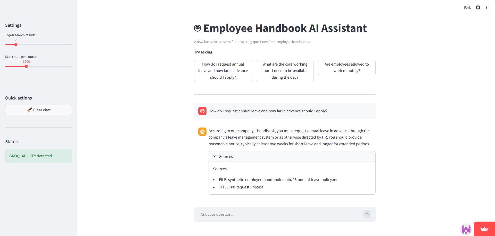

# Employee Handbook AI Assistant

A Retrieval-Augmented Generation (RAG) based AI assistant that answers employee policy questions using semantic search and large language models.

## Features

- Ingests documentation from a GitHub repository
- Chunking, embedding, and vector-based semantic search
- Source-grounded answers with citations
- Streamlit-based interactive UI
- Deployed on Streamlit Cloud

## Tech Stack

- Python
- Streamlit
- Sentence Transformers
- Vector Search
- Groq LLM API

## Live Demo

🔗 https://employee-handbook-ai-assistant-drmdst2q9fpmlaoblblntm.streamlit.app

## Screenshots
### Homepage & Example QA

## Dataset

This project uses a synthetic employee handbook dataset created for testing RAG systems.

## Notes

This is a portfolio project demonstrating end-to-end RAG system design, including data ingestion, retrieval, and answer generation.